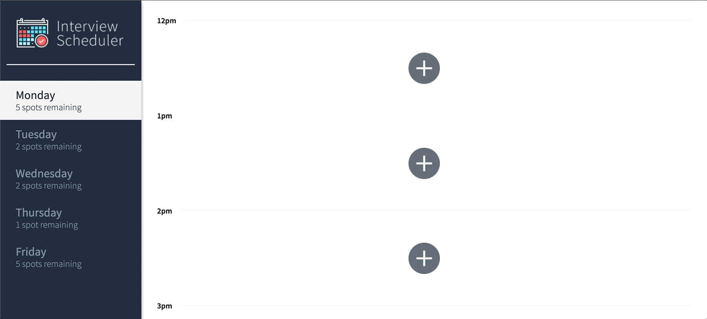

# Interview Scheduler

Hello ! Welcome and thank you for downloading Interview Scheduler !

## About

This project was created as part of educational journey into React web development and testing with Jest and Cypress, and is intended to be shown as a demonstration of all I have learned so far from the React unit in this program.



This app will allow a student to book, edit, and cancel an interview, as well as view other peoples' interviews! The appointments are limited to 5 days a week, from noon till 5pm in one hour time slots. A student can book an interview in any available time slot!

The days will also display a number of spots available based on how many appointments are booked during that day, this number changes in real time when an interview is booked or cancelled!

Here we see an interview appointment being edited.


And here an interview is deleted.


## Getting Started

Install the dependencies with `npm install`.

Run the Webpack Development Server using:

```sh
npm start
```

Run the Jest Test Framework using:

```sh
npm test
```

## Dependencies

- axios
- @testing-library/react-hooks
- react-test-renderer